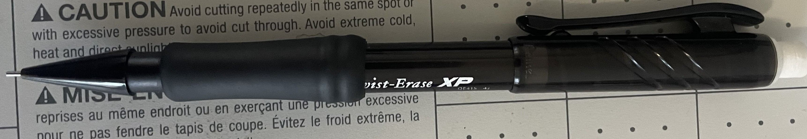
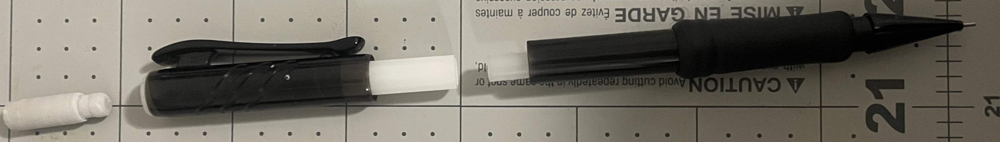
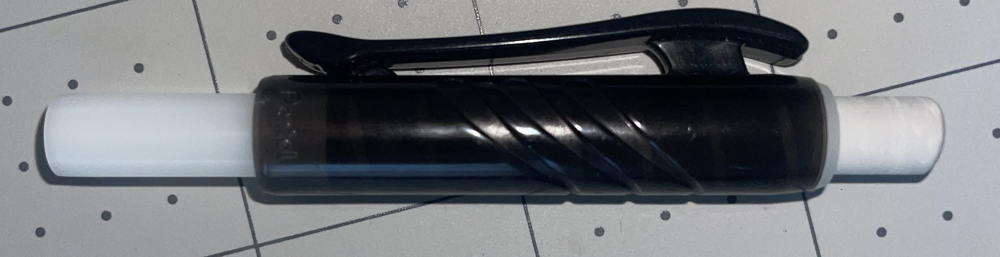
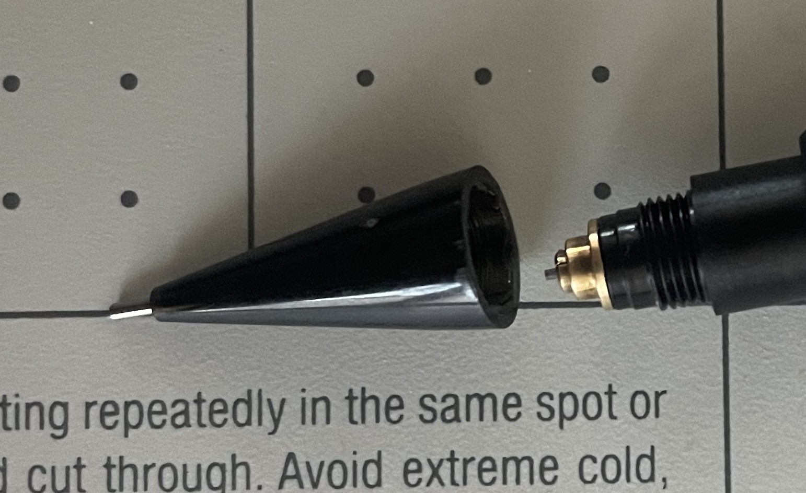

# A1 – Build Your Professional Portfolio

## Portfolio Analysis
### First Analysis
My first portfolio analysis will be of Evan Hoerl's Engineering Portfolio on Github. Here is the link https://ejhoerl.github.io/index.html.

The layout of his portfolio makes locating specific assignments and projects very easy and quick. Right under his about me section he has a labeled dedicated projects section with labels and pictures for each project. Below each project label is a brief distraction and a 'learn more' prompt that takes the reader to a separate page with a lot more information. This makes everything very organized and easy to navigate. The reader would be able to find any project under 60 sections thanks to this design. 

His documentation for some of his projects definitely give enough information that a colleague could reproduce the project, while others do not. In his PF20 project for example, he clearly documented the design set, manufacturing set, testing set, models of the project, and the materials they used. However, for his other projects he did not document what materials he choice to use for example. 

His portfolio documented how some decisions were made. His PF20 Project mentions different reasoning for building with specific materials, using a specific software for testing, and the design of the project. Some of this older projects did not explain things as thoroughly, or at all. 

His language through out the portfolio does meet the standard a employer would expect. It is very direct, explains thoroughly, uses correct grammar and punctuation, and does not use slang. 

### Second Analysis
My second portfolio analysis will be of Katie Heinemann's portfolio on Squarespace. Here is the link https://katieheinemann.space/portfolio.html

Her website layout is very organized with each section having its own labeled tab that can easily be located on the right corner. Putting her portfolio on a separate page makes it easy to focus on her work and is very straightforward. Once you are on the portfolio page, every project has a title, subtitle, information explaining it, and references underneath. This all makes it very easy for the reader to navigate and find projects under 60 seconds. 

Her portfolio does not give the reader enough information to replicate without asking any follow up questions. Each project has only a paragraph or two giving a brief summery of the project. She does not go into any details about designs, materials, issues they faced, or solutions.

She does not show how decisions were made during her projects through out her portfolio. 

Her language does meet the standard of something you would give to an employer. The writing is very direct, using correct grammar and punctuation, and does not use slang.

## Product Analyze
The product I choice to analyze was a mechanical pencil. The primary function of this product is to push out a small portion of graphite as needed and keep it at rest to allow the user to write. 

This product uses a combination of different physics properties to accomplish this primary function, such as static friction, screws, springs, and normal force. I will describe how these physical properties work in the mechanical pencil and what they accomplish for a specific model of mechanical pencil. 

The model I am looking at is the Pentel Twist-Erase mechanical pencil.  

The pencil has three pieces help together by friction, A removeable top portion, the eraser, and the body of the mechanical pencil. This allows them to stay put when being used or carried but makes it super easy to switch out the eraser or add more graphite as needed by just applying a little force.

Photo of the mechanical pencil in three pieces.

 The eraser can move up and down as needed by simply twisting either section of the mechanical pencil. This is because of a screw like mechanism inside the top portion of the pencil holding the eraser. This works because screws turn rotational movement and torque into linear movement. The top portion and body of the mechanical pencil are held together by static friction, which is what allows the user to rotate either side and that friction is the force acting upon the screw inside the pencil.

Photo of the top portion of the mechanical pencil. The threads inside are faintly visible.

The graphite dispenser works anytime force is applied to the eraser end of the pencil. To apply this force all you have to do is push down on the eraser to click it. This is possible because of the geometry of the top portion and body of the pencil and because the two pieces are kept together only by friction. Clicking the eraser end of the pencil applies a force to a spring located near the graphite tip of the pencil. The graphite rests in a cylinder split into two pieces. Around These half cylinders is a circular stopper that, when this system is in rest, holds the two half cylinder pieces together. This circular stopper keeps the graphite from slipping using static friction until the system is acted upon. This spring moves both the graphite and two half cylinders. The normal force from the plastic tip keeps the circular stopper in place, allowing the two cylinder halves to split and dispense graphite. When the user stops applying a force at the eraser end of the pencil, the elastic potential energy caused by compressing the spring creates a force in the opposite direction. This resets the system while keeping enough graphite out, allowing the user to write.

Photos of inside the mechanical pencil tip. The first photo is what the mechanical pencil tip looks like at rest. The second photo shows what happens when the half cylinders are pushed down while another force keeps the cylinder stopper from moving.

Photo of the plastic tip unscrewed

### Patent Research
The patent number for the pencil is USD611535S1 and Kazuhisa Shimizu is the author.

### Alternative Solution
Some alternative devices could be a wooden pencil or a ball point pen.

### One Design choice
The original engineer made a eraser holder at the top. I believe they made this choice because most pencils have an eraser in that area and the user would most likely be used it it, and it is in an easy spot to use and refill.

## Decide
### Homepage
  The homepage is the first thing the reader will see in my portfolio. This makes the layout, information and organization very important. The first thing on my homepage is a title and a quick description of what this portfolio. This description tells the reader what the portfolio is for, what structure each assignment will follow, and a reason for the structure. After this introduction there is another section going into more detail about the analyze, decide, and communicate structure
that allows the reader to know exactly what each category means. The last section after this is explaining what I will be doing throughout the semester in three separate acts. This makes finding specific assignments or topics easier to locate for a reader. Overall, the homepage is here to let the reader understand the purpose of this portfolio and show they what they can expect.

### Intentional Customization
I added more smaller subtitles under each section. This makes the page look more organized and allows the reader to find specific information inside a category a lot easier. 

### Documentation Standard
Every assignment is going to be structured in a way that is easy to follow, easy to understand, well organized, very detailed, and contains informative pictures.

